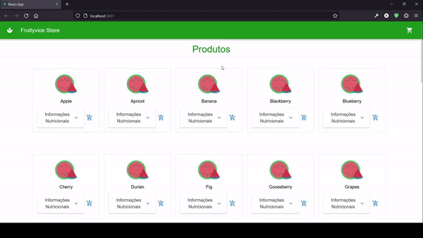

# Fruityvice Store
<p>Loja de frutas online<p/>

## Demonstração:


## Tecnologias Utilizadas:
* Javascript/Typescript
* React
* Material UI
* Axios/React Express
</br>

## Como Executar:
Abra um terminal
```sh
git clone https://github.com/Rafael-BD/Fruityvice
```
```sh
cd Fruityvice
```
</br>

Executar o backend que fará a requisição para a api externa e retornará a lista de frutas para o frontend:
```sh
cd api
```
```sh
npm i 
```
```sh
npm start
```
</br>

* Abra um novo terminal na raiz da pasta Fruityvice. </br>
Executar a aplicação web React:
```sh
cd app
```
```sh
npm i 
```
```sh
npm start 
```
* Aplicação iniciada 
